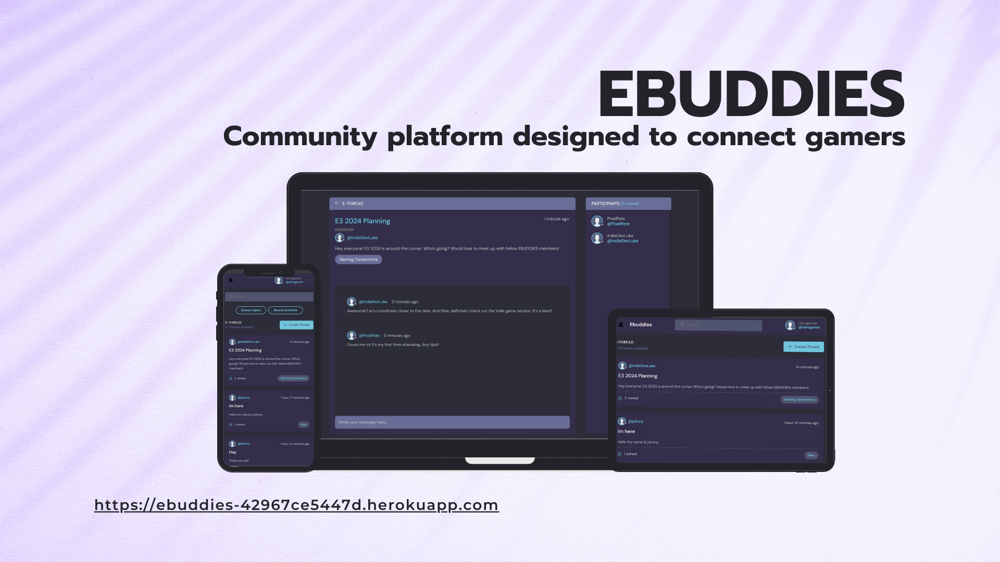

# [EBUDDIES](https://ebuddies-42967ce5447d.herokuapp.com)

[](https://github.com/JohnnySonTrinh/ebuddies/commits/main)
[](https://github.com/JohnnySonTrinh/ebuddies/commits/main)
[](https://github.com/JohnnySonTrinh/ebuddies)

Welcome to EBUDDIES, community platform designed to connect gamers with shared interests and hobbies. Our mission is to create a welcoming space where users can find and interact with like-minded peers, share experiences, and build meaningful connections.




## UX

The design of **Ebuddies** was planned to create an intuitive, engaging, and seamless experience for our users.

### Colour Scheme

- `#e5e5e5` used for primary text.
- `#71c6dd` used for primary highlights.
- `#b2bdbd` used for secondary text.
- `#8b8b8b` used for secondary highlights.

I used [coolors.co](https://coolors.co/71c6dd-3f4156-51546e-696d97-e5e5e5-8b8b8b-b2bdbd-2d2d39-5dd693-fc4b0b) to generate my colour palette.


I've used CSS `:root` variables to easily update the global colour scheme by changing only one value, instead of everywhere in the CSS file.

```css
:root {
  --clr-main: #71c6dd;
  --clr-main-light: #e1f6fb;
  --clr-dark: #342e4a;
  --clr-dark-medium: #51546e;
  --clr-dark-light: #696d97;
  --clr-light: #e5e5e5;
  --clr-gray: #8b8b8b;
  --clr-light-gray: #b2bdbd;
  --clr-bg: #2d2d39;
  --clr-success: #5dd693;
  --clr-error: #fc4b0b;
}
```

### Typography

- [DM Sans](https://fonts.google.com/specimen/DM+Sans) was used for the whole site.


## User Stories

### New Site Users

- As a new site user, I would like to easily sign up for an account, so that I can start participating in community discussions as quickly as possible.
- As a new site user, I would like to browse different topics without signing up.
- As a new site user, I would like to search for threads, so that I can find threads that match my hobbies and preferences.
- As a new site user, I would like to create profile, so that I attract like-minded individuals.

### Returning Site Users

- As a returning site user, I would like to see new posts in my, so that I can stay up to date with discussions that interest me.
- As a returning site user, I would like to easily find and join live events or meetups organized by the community, so that I can engage with the community in real-time and strengthen my connections.
- As a returning site user, I would like to be able to edit threads and posts that I created, so that I can easily change the content.

### Site Admin

- As a site administrator, I should be able to monitor and moderate forum discussions, so that I can ensure a respectful and safe environment for all users.
- As a site administrator, I should be able to view and analyze user activity and engagement metrics, so that I can make informed decisions to improve the platform.
- As a site administrator, I should be able to create and manage categories and forums, so that I can organize content in a way that best serves the community's interests.
- As a site administrator, I should be able to ban or suspend users who violate community guidelines, so that I can maintain the integrity and safety of the community.
- As a site administrator, I should be able to update and implement new features based on user feedback, so that I can continuously improve the user experience and meet the evolving needs of the community.

## Wireframes

To follow best practice, wireframes were developed for mobile, tablet, and desktop sizes.
I've used [Balsamiq](https://balsamiq.com/wireframes) to design my site wireframes.

### Mobile Wireframes

<details>
<summary> Click here to see the Mobile Wireframes </summary>

Home
  - 

Profle
  - 

Log in
  - 

Sign up
  - 


</details>

### Tablet Wireframes

<details>
<summary> Click here to see the Tablet Wireframes </summary>

Home
  - 

Profle
  - 

Log in
  - 

Sign up
  - 


</details>

### Desktop Wireframes

<details>
<summary> Click here to see the Desktop Wireframes </summary>

Home
  - 

Profle
  - 

Log in
  - 

Sign up
  - 

</details>

## Testing

For all testing, please refer to the [TESTING.md](TESTING.md) file.
