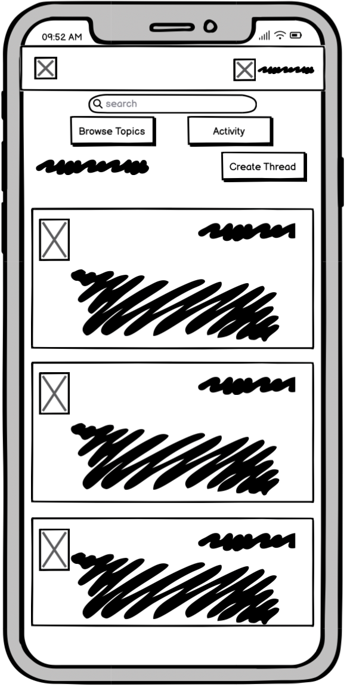
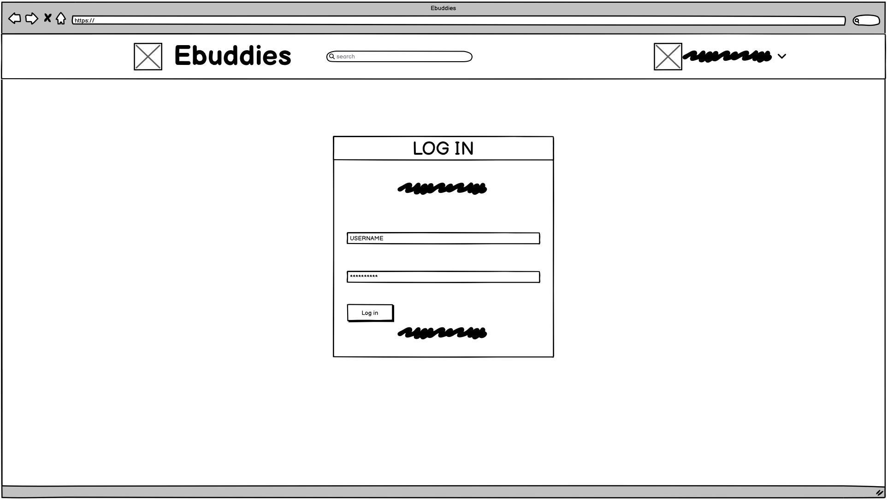
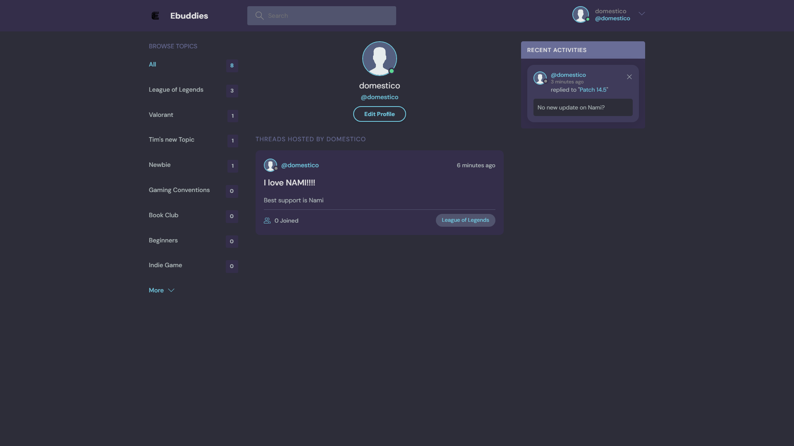

# [EBUDDIES](https://ebuddies-42967ce5447d.herokuapp.com)

[](https://github.com/JohnnySonTrinh/ebuddies/commits/main)
[](https://github.com/JohnnySonTrinh/ebuddies/commits/main)
[](https://github.com/JohnnySonTrinh/ebuddies)

Welcome to EBUDDIES, community platform designed to connect gamers with shared interests and hobbies. Our mission is to create a welcoming space where users can find and interact with like-minded peers, share experiences, and build meaningful connections.


## UX

The design of **Ebuddies** was planned to create an intuitive, engaging, and seamless experience for our users.

### Colour Scheme

- `#e5e5e5` used for primary text.
- `#71c6dd` used for primary highlights.
- `#b2bdbd` used for secondary text.
- `#8b8b8b` used for secondary highlights.

I used [coolors.co](https://coolors.co/71c6dd-3f4156-51546e-696d97-e5e5e5-8b8b8b-b2bdbd-2d2d39-5dd693-fc4b0b) to generate my colour palette.


I've used CSS `:root` variables to easily update the global colour scheme by changing only one value, instead of everywhere in the CSS file.

```css
:root {
  --clr-main: #71c6dd;
  --clr-main-light: #e1f6fb;
  --clr-dark: #342e4a;
  --clr-dark-medium: #51546e;
  --clr-dark-light: #696d97;
  --clr-light: #e5e5e5;
  --clr-gray: #8b8b8b;
  --clr-light-gray: #b2bdbd;
  --clr-bg: #2d2d39;
  --clr-success: #5dd693;
  --clr-error: #fc4b0b;
}
```

### Typography

- [DM Sans](https://fonts.google.com/specimen/DM+Sans) was used for the whole site.


## User Stories

### New Site Users

- As a new site user, I would like to easily sign up for an account, so that I can start participating in community discussions as quickly as possible.
- As a new site user, I would like to browse different topics without signing up.
- As a new site user, I would like to search for threads, so that I can find threads that match my hobbies and preferences.
- As a new site user, I would like to create profile, so that I attract like-minded individuals.

### Returning Site Users

- As a returning site user, I would like to see new posts in my, so that I can stay up to date with discussions that interest me.
- As a returning site user, I would like to easily find and join live events or meetups organized by the community, so that I can engage with the community in real-time and strengthen my connections.
- As a returning site user, I would like to be able to edit threads and posts that I created, so that I can easily change the content.

### Site Admin

- As a site administrator, I should be able to monitor and moderate forum discussions, so that I can ensure a respectful and safe environment for all users.
- As a site administrator, I should be able to view and analyze user activity and engagement metrics, so that I can make informed decisions to improve the platform.
- As a site administrator, I should be able to create and manage categories and forums, so that I can organize content in a way that best serves the community's interests.
- As a site administrator, I should be able to ban or suspend users who violate community guidelines, so that I can maintain the integrity and safety of the community.
- As a site administrator, I should be able to update and implement new features based on user feedback, so that I can continuously improve the user experience and meet the evolving needs of the community.

## Wireframes

To follow best practice, wireframes were developed for mobile, tablet, and desktop sizes.
I've used [Balsamiq](https://balsamiq.com/wireframes) to design my site wireframes.

### Mobile Wireframes

<details>
<summary> Click here to see the Mobile Wireframes </summary>

Home
  - 

Profle
  - 

Log in
  - 

Sign up
  - 


</details>

### Tablet Wireframes

<details>
<summary> Click here to see the Tablet Wireframes </summary>

Home
  - 

Profle
  - 

Log in
  - 

Sign up
  - 


</details>

### Desktop Wireframes

<details>
<summary> Click here to see the Desktop Wireframes </summary>

Home
  - 

Profle
  - 

Log in
  - 

Sign up
  - 

</details>

## Features

Ebuddies Features

### Existing Features

- **User Registration and Log-in**

    - Users can sign up/log in for EBUDDIES to connect with like-minded individuals.


- **Community Topics and Discussion Threads**

    - The platform offers various forums based on different interests. Within these Topics, users can start discussion threads or contribute to existing ones. This feature is the core of the community, allowing for the exchange of ideas, advice, and experiences.


- **Recent Activities**

    - Users can easily stay up-to-date with the latest discussions in their communities, ensuring they're always in the loop.


- **Browse and Search Topics**

    - Enhances users' ability to discover new topics and threads that match their interests, encouraging exploration and engagement with new communities.


- **Create and Update Threads**

    - A straightforward process for creating and update threads ensures that even users new to the platform can easily share their thoughts and questions with the community.


- **Post Messages in Threads**

    - The Post Messages in Threads feature enables users to actively participate in discussions by writing and submitting messages within any thread on EBUDDIES. This core functionality fosters interactive dialogue, allowing users to share insights, ask questions, and provide support, thereby enhancing the vibrancy and connectivity of the community.


- **View User Profiles**

    - The View User Profiles feature on EBUDDIES allows users to view their own profile as well as the profiles of other community members. This functionality enhances the social aspect of the platform.



### Future Features

- Change Avatar/images
    - User can upload images/profile picture as a avatar.
- Update password
    - User can update password in settings.
- About/bio
    - User can have a description about themself.
- Tags
    - User can have tags in there threads.

## Tools & Technologies Used

- [](https://git-scm.com) used for version control. (`git add`, `git commit`, `git push`)
- [](https://github.com) used for secure online code storage.
- [](https://code.visualstudio.com) used as my local IDE for development.
- [](https://en.wikipedia.org/wiki/HTML) used for the main site content.
- [](https://en.wikipedia.org/wiki/CSS) used for the main site design and layout.
- [](https://www.javascript.com) used for user interaction on the site.
- [](https://www.python.org) used as the back-end programming language.
- [](https://www.heroku.com) used for hosting the deployed back-end site.
- [](https://www.djangoproject.com) used as the Python framework for the site.
- [](https://www.postgresql.org) used as the relational database management.
- [](https://whitenoise.readthedocs.io) used for serving static files with Heroku.
- [](https://aws.amazon.com/s3) used for online static file storage.
- [](https://balsamiq.com/wireframes) used for creating wireframes.
- [](https://www.canva.com/p/canvawireframes) used for creating wireframes.

## Database Design

Entity Relationship Diagrams (ERD) help to visualize database architecture before creating models.
Understanding the relationships between different tables can save time later in the project.


```python
class Topic(models.Model):
    name = models.CharField(max_length=200)

    def __str__(self):
        return self.name

class Thread(models.Model):
    host = models.ForeignKey(User, on_delete=models.SET_NULL, null=True, blank=True)
    topic = models.ForeignKey(Topic, on_delete=models.SET_NULL, null=True, blank=True)
    name = models.CharField(max_length=200)
    description = models.TextField(null=True, blank=True)
    participants = models.ManyToManyField(User, related_name='participants', blank=True)
    updated = models.DateTimeField(auto_now=True)
    created = models.DateTimeField(auto_now_add=True)

    class Meta:
        ordering = ['-updated', '-created']

    def __str__(self):
        return self.name
    
class Message(models.Model):
    user = models.ForeignKey(User, on_delete=models.CASCADE)
    thread = models.ForeignKey(Thread, on_delete=models.CASCADE)
    body = models.TextField()
    updated = models.DateTimeField(auto_now=True)
    created = models.DateTimeField(auto_now_add=True)

    class Meta:
        ordering = ['-updated', '-created']

    def __str__(self):
        return self.body[0:50]
```

## Agile Development Process

### GitHub Projects

[GitHub Projects](https://github.com/JohnnySonTrinh/ebuddies/projects) served as an Agile tool for this project.
It isn't a specialized tool, but with the right tags and project creation/issue assignments, it can be made to work.

Through it, user stories, issues, and milestone tasks were planned, then tracked on a weekly basis using the basic Kanban board.


### GitHub Issues

[GitHub Issues](https://github.com/JohnnySonTrinh/ebuddies/issues) served as an another Agile tool.
There, I used my own **User Story Template** to manage user stories.

It also helped with milestone iterations on a weekly basis.

- [Open Issues](https://github.com/JohnnySonTrinh/ebuddies/issues) [](https://github.com/JohnnySonTrinh/ebuddies/issues)

    

- [Closed Issues](https://github.com/JohnnySonTrinh/ebuddies/issues?q=is%3Aissue+is%3Aclosed) [](https://github.com/JohnnySonTrinh/ebuddies/issues?q=is%3Aissue+is%3Aclosed)

    

### MoSCoW Prioritization

I've decomposed my Epics into stories prior to prioritizing and implementing them.
Using this approach, I was able to apply the MoSCow prioritization and labels to my user stories within the Issues tab.

- **Must Have**: guaranteed to be delivered (*max 60% of stories*)
- **Should Have**: adds significant value, but not vital (*the rest ~20% of stories*)
- **Could Have**: has small impact if left out (*20% of stories*)
- **Won't Have**: not a priority for this iteration

## Testing

> [!NOTE]  
> For all testing, please refer to the [TESTING.md](TESTING.md) file.

## Deployment

The live deployed application can be found deployed on [Heroku](https://ebuddies-42967ce5447d.herokuapp.com).

### PostgreSQL Database

This project uses a [Code Institute PostgreSQL Database](https://dbs.ci-dbs.net).

To obtain my own Postgres Database from Code Institute, I followed these steps:

- Signed-in to the CI LMS using my email address.
- An email was sent to me with my new Postgres Database.

> [!CAUTION]  
> - PostgreSQL databases by Code Institute are only available to CI Students.
> - You must acquire your own PostgreSQL database through some other method
> if you plan to clone/fork this repository.
> - Code Institute students are allowed a maximum of 8 databases.
> - Databases are subject to deletion after 18 months.

### Heroku Deployment

This project uses [Heroku](https://www.heroku.com), a platform as a service (PaaS) that enables developers to build, run, and operate applications entirely in the cloud.

Deployment steps are as follows, after account setup:

- Select **New** in the top-right corner of your Heroku Dashboard, and select **Create new app** from the dropdown menu.
- Your app name must be unique, and then choose a region closest to you (EU or USA), and finally, select **Create App**.
- From the new app **Settings**, click **Reveal Config Vars**, and set your environment variables.

> [!IMPORTANT]  
> This is a sample only; you would replace the values with your own if cloning/forking my repository.

| Key | Value |
| --- | --- |
| `CLOUDINARY_URL` | user's own value |
| `DATABASE_URL` | user's own value |
| `DISABLE_COLLECTSTATIC` | 1 (*this is temporary, and can be removed for the final deployment*) |
| `SECRET_KEY` | user's own value |

Heroku needs three additional files in order to deploy properly.

- requirements.txt
- Procfile
- runtime.txt

You can install this project's **requirements** (where applicable) using:

- `pip3 install -r requirements.txt`

If you have your own packages that have been installed, then the requirements file needs updated using:

- `pip3 freeze --local > requirements.txt`

The **Procfile** can be created with the following command:

- `echo web: gunicorn app_name.wsgi > Procfile`
- *replace **app_name** with the name of your primary Django app name; the folder where settings.py is located*

The **runtime.txt** file needs to know which Python version you're using:
1. type: `python3 --version` in the terminal.
2. in the **runtime.txt** file, add your Python version:
	- `python-3.9.18`

For Heroku deployment, follow these steps to connect your own GitHub repository to the newly created app:

Either:

- Select **Automatic Deployment** from the Heroku app.

Or:

- In the Terminal/CLI, connect to Heroku using this command: `heroku login -i`
- Set the remote for Heroku: `heroku git:remote -a app_name` (replace *app_name* with your app name)
- After performing the standard Git `add`, `commit`, and `push` to GitHub, you can now type:
	- `git push heroku main`

The project should now be connected and deployed to Heroku!

### Local Deployment

This project can be cloned or forked in order to make a local copy on your own system.

For either method, you will need to install any applicable packages found within the *requirements.txt* file.

- `pip3 install -r requirements.txt`.

You will need to create a new file called `env.py` at the root-level,
and include the same environment variables listed above from the Heroku deployment steps.

> [!IMPORTANT]  
> This is a sample only; you would replace the values with your own if cloning/forking my repository.

Sample `env.py` file:

```python
import os

os.environ.setdefault("CLOUDINARY_URL", "user's own value")
os.environ.setdefault("DATABASE_URL", "user's own value")
os.environ.setdefault("SECRET_KEY", "user's own value")

# local environment only (do not include these in production/deployment!)
os.environ.setdefault("DEBUG", "True")
```

Once the project is cloned or forked, in order to run it locally, you'll need to follow these steps:

- Start the Django app: `python3 manage.py runserver`
- Stop the app once it's loaded: `CTRL+C` or `⌘+C` (Mac)
- Make any necessary migrations: `python3 manage.py makemigrations`
- Migrate the data to the database: `python3 manage.py migrate`
- Create a superuser: `python3 manage.py createsuperuser`
- Load fixtures (if applicable): `python3 manage.py loaddata file-name.json` (repeat for each file)
- Everything should be ready now, so run the Django app again: `python3 manage.py runserver`

#### Cloning

You can clone the repository by following these steps:

1. Go to the [GitHub repository](https://github.com/JohnnySonTrinh/ebuddies) 
2. Locate the Code button above the list of files and click it 
3. Select if you prefer to clone using HTTPS, SSH, or GitHub CLI and click the copy button to copy the URL to your clipboard
4. Open Git Bash or Terminal
5. Change the current working directory to the one where you want the cloned directory
6. In your IDE Terminal, type the following command to clone my repository:
	- `git clone https://github.com/JohnnySonTrinh/ebuddies.git`
7. Press Enter to create your local clone.

Alternatively, if using Gitpod, you can click below to create your own workspace using this repository.

[](https://gitpod.io/#https://github.com/JohnnySonTrinh/ebuddies)

Please note that in order to directly open the project in Gitpod, you need to have the browser extension installed.
A tutorial on how to do that can be found [here](https://www.gitpod.io/docs/configure/user-settings/browser-extension).

#### Forking

By forking the GitHub Repository, we make a copy of the original repository on our GitHub account to view and/or make changes without affecting the original owner's repository.
You can fork this repository by using the following steps:

1. Log in to GitHub and locate the [GitHub Repository](https://github.com/JohnnySonTrinh/ebuddies)
2. At the top of the Repository (not top of page) just above the "Settings" Button on the menu, locate the "Fork" Button.
3. Once clicked, you should now have a copy of the original repository in your own GitHub account!

### Local VS Deployment

#### Environment Variables
- **Local**: Environment variables might be set directly in me development environment or stored in a .env file that is not committed to version control for security reasons.
- **Deployment**: On Heroku, environment variables should be set through the platform's settings (Config Vars) to keep sensitive information like database URLs, secret keys, and third-party API keys secure.
#### Database
- **Local**: I use SQLite as your database for simplicity and ease of setup in a local development environment.
- **Deployment**: On Heroku, I use a more robust database like PostgreSQL. Heroku offers its own PostgreSQL service, which can be easily integrated into the project.

## Credits

### Content

| Source | Location | Notes |
| --- | --- | --- |
| [Markdown Builder](https://tim.2bn.dev/markdown-builder) | README and TESTING | tool to help generate the Markdown files |
| [Chris Beams](https://chris.beams.io/posts/git-commit) | version control | "How to Write a Git Commit Message" |
| [W3Schools](https://www.w3schools.com/howto/howto_js_topnav_responsive.asp) | entire site | responsive HTML/CSS/JS navbar |
| [Dennis Ivy](https://www.youtube.com/@DennisIvy) | entire site | Django tutorials and how to deploy on Heroku |
| [Django docs](https://docs.djangoproject.com/en/5.0/) | entire site | Django/python syntax |
| [WhiteNoise](http://whitenoise.evans.io) | entire site | hosting static files on Heroku temporarily |

### Media

| Source | Location | Type | Notes |
| --- | --- | --- | --- |
| [Squoosh](https://squoosh.app/) | entire site | image | tool for image compression |
| [Canva](https://www.canva.com/) | entire site | image | tool for edit images |
| [Lucid Software](https://www.youtube.com/watch?v=xsg9BDiwiJE) | Database | ERD | tutorial for lucichart and ERD |
| [Markdown Builder](https://tim.2bn.dev/markdown-builder) | README and TESTING | tool | tool to help generate the Markdown files |

### Acknowledgements

- I would like to thank my Code Institute mentor, [Tim Nelson](https://github.com/TravelTimN) for his support throughout the development of this project.
- I would like to thank the [Code Institute Swedish Slack community](https://code-institute-room.slack.com) for the moral support and testing.
- Speical thanks to my dog Loke for being my "rubber duck debugging" tool
