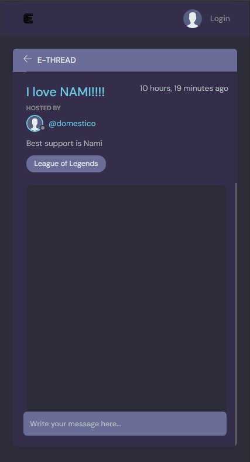

# Testing

> [!NOTE]  
> Return back to the [README.md](README.md) file.

Welcome to the Ebuddies Site testing results, in this file you will see how each and every element and features tested to ensure each features worked as intended.

## Code Validation

### HTML

I have used the recommended [HTML W3C Validator](https://validator.w3.org) to validate all of my pages.

| Page | Screenshot | Notes |
| ---- | ---------- | ----- |
| [Home](https://ebuddies-42967ce5447d.herokuapp.com/) |  | [ERROR] Bad Value |
| [Log-in](https://ebuddies-42967ce5447d.herokuapp.com/login/) |  | [NO ERROR] |
| [Register](https://ebuddies-42967ce5447d.herokuapp.com/register/) |  | [ERROR] 3 The aria-describedby attribute must point to an element in the same document.|
| [Topics](https://ebuddies-42967ce5447d.herokuapp.com/topics/) |  | [ERROR] Bad value |
| [Profile](https://ebuddies-42967ce5447d.herokuapp.com/profile/1/) |  | [ERROR] Bad value |
| [Thread](https://ebuddies-42967ce5447d.herokuapp.com/thread/8/) |  | [NO ERROR] |

### CSS

I have used the recommended [CSS Jigsaw Validator](https://jigsaw.w3.org/css-validator) to validate all of my CSS files.

| Local | Live | Notes |
| --- | --- | --- |
|  |  | Only warrnings -webkit [Local] import fonts warrning |

### JavaScript

I have used the recommended [JShint Validator](https://jshint.com) to validate all of my JS files.

| Directory | File | Screenshot | Notes |
| --- | --- | --- | --- |
| static | script.js |  | No Error |

### Python

I have used the recommended [PEP8 CI Python Linter](https://pep8ci.herokuapp.com) to validate all of my Python files.

| Directory | File | CI URL | Screenshot | Notes |
| --- | --- | --- | --- | --- |
| base | admin.py | [PEP8 CI](https://pep8ci.herokuapp.com/https://raw.githubusercontent.com/JohnnySonTrinh/ebuddies/main/base/admin.py) |  | NO ERRORS |
| base | forms.py | [PEP8 CI](https://pep8ci.herokuapp.com/https://raw.githubusercontent.com/JohnnySonTrinh/ebuddies/main/base/forms.py) |  | NO ERRORS |
| base | models.py | [PEP8 CI](https://pep8ci.herokuapp.com/https://raw.githubusercontent.com/JohnnySonTrinh/ebuddies/main/base/models.py) |  | NO ERRORS |
| base | urls.py | [PEP8 CI](https://pep8ci.herokuapp.com/https://raw.githubusercontent.com/JohnnySonTrinh/ebuddies/main/base/urls.py) |  | NO ERRORS |
| base | views.py | [PEP8 CI](https://pep8ci.herokuapp.com/https://raw.githubusercontent.com/JohnnySonTrinh/ebuddies/main/base/views.py) |  | NO ERRORS |
| ebuddies | urls.py | [PEP8 CI](https://pep8ci.herokuapp.com/https://raw.githubusercontent.com/JohnnySonTrinh/ebuddies/main/ebuddies/urls.py) |  | NO ERRORS |
| root | manage.py | [PEP8 CI](https://pep8ci.herokuapp.com/https://raw.githubusercontent.com/JohnnySonTrinh/ebuddies/main/manage.py) |  |NO ERRORS |

## Browser Compatibility

I've tested my deployed project on multiple browsers to check for compatibility issues.

| Browser | Home | Profile | Log In | Register | Thread | Topic | Notes |
| ------- | ---- | ------- | ------ | -------- | ------ | ----- | ----- |
| Chrome |  |  |  |  |  |  | Works as expected |
| Firefox |  |  |  |  |  |  | Works as expected |
| Opera GX |  |  |  |  |  |  | Works as expected |
| Safari |  |  |  |  |  |  | Works as expected |

## Responsiveness

I've tested my deployed project on multiple devices to check for responsiveness issues.

| Device | Home | Thread | Profile | Notes |
| ------ | ---- | ----- | ------- | ----- |
| Mobile (DevTools) |  |  |  | Works as expected |
| Tablet (DevTools) |  |  |  | Works as expected |
| 4K Monitor (DevTools) |  |  |  | Scaling starts to have minor issues |
| Desktop (Windows)|  |  |  | Works as expected |
| Laptop (Mac) |  |  |  | Works as expected |
| iPhone 14 |  |  |  | Works as expected |
| iPad |  |  |  | Works as expected |

## Lighthouse Audit

I've tested my deployed project using the Lighthouse Audit tool to check for any major issues.

| Page | Mobile | Desktop | Notes |
| --- | --- | --- | --- |
| Home |  |  | Some minor warnings |
| Thread |  |  | Accessibility warnings (desktop) |
| Profile |  |  | Some minor warnings |

## Automated Testing

I have conducted a series of automated tests on my application.

I fully acknowledge and understand that, in a real-world scenario, an extensive set of additional tests would be more comprehensive.

### Python (Unit Testing)

Unit Testing Report for eBuddies

**Overview**

This document outlines the results of the unit testing performed on the eBuddies Django application. The tests were designed to verify the integrity and expected behavior of the models within the application.

**Test Environment**

- **Platform**: Django Framework
- **Language**: Python
- **Database**: Test Database (Django's default testing environment)

**Test Execution**

Tests were executed using Django's built-in manage.py test command, which automatically creates a test database, runs the tests, and then destroys the test database to ensure isolation.

tests.py:
```python
from django.test import TestCase
from django.contrib.auth.models import User
from .models import Topic, Thread, Message

class TopicModelTest(TestCase):
    @classmethod
    def setUpTestData(cls):
        Topic.objects.create(name='Django')

    def test_topic_str(self):
        topic = Topic.objects.get(id=1)
        expected_object_name = 'Django'
        self.assertEqual(str(topic), expected_object_name)

class ThreadModelTest(TestCase):
    @classmethod
    def setUpTestData(cls):
        user = User.objects.create_user(username='john', password='12345')
        topic = Topic.objects.create(name='Django')
        Thread.objects.create(name='First Thread', description='A test thread', host=user, topic=topic)

    def test_thread_str(self):
        thread = Thread.objects.get(id=1)
        expected_object_name = 'First Thread'
        self.assertEqual(str(thread), expected_object_name)

    def test_thread_ordering(self):
        self.assertEqual(Thread._meta.ordering, ['-updated', '-created'])

class MessageModelTest(TestCase):
    @classmethod
    def setUpTestData(cls):
        user = User.objects.create_user(username='john', password='12345')
        topic = Topic.objects.create(name='Django')
        thread = Thread.objects.create(name='First Thread', host=user, topic=topic)
        Message.objects.create(user=user, thread=thread, body='Hello, world!')

    def test_message_str(self):
        message = Message.objects.get(id=1)
        expected_object_body_start = 'Hello, world!'[:50]
        self.assertEqual(str(message), expected_object_body_start)

    def test_message_ordering(self):
        self.assertEqual(Message._meta.ordering, ['-updated', '-created'])
```
Command used:

```python
python manage.py test
```
**Test Cases**

**TopicModelTest**
- **Objective**: Verify the __str__ method of the Topic model.
- **Method**: test_topic_str
- **Result**: Passed
- **Details**: Ensures the string representation of a Topic instance matches its name attribute.
**ThreadModelTest**
- **Objective**: Validate the __str__ method and ordering of the Thread model.
- **Methods**:
- **test_thread_str**: Passed
- **test_thread_ordering**: Passed
- **Details**: Confirms the string representation of a Thread instance matches its name attribute and that threads are ordered by their updated and created timestamps.

**MessageModelTest**
- **Objective: Test the __str__ method and ordering of the Message model.
- **Methods:
- **test_message_str: Passed
- **test_message_ordering: Passed
- **Details: Verifies the string representation of a Message instance correctly displays the first 50 characters of its body and that messages are ordered by their updated and created timestamps.

**Summary**

- Total Tests: 5
- Passed: 5
- Failed: 0
- Execution Time: 0.968 seconds

**Conclusion**

The successful execution of all unit tests for the eBuddies application models indicates robust and reliable model behavior according to the defined test cases. This provides a solid foundation for further development and refactoring with confidence in the stability of existing functionalities.

## Bugs

- 89: E501 line too long (91 > 79 characters)
- 92: E501 line too long (81 > 79 characters)
- 95: E501 line too long (82 > 79 characters)
- 98: E501 line too long (83 > 79 characters)

    

    - To fix this, the long strings are broken up using parentheses which allow Python to automatically concatenate the string literals that are next to each other. Each part of the string is on a new line, ensuring that no line goes over the 79-character limit.

