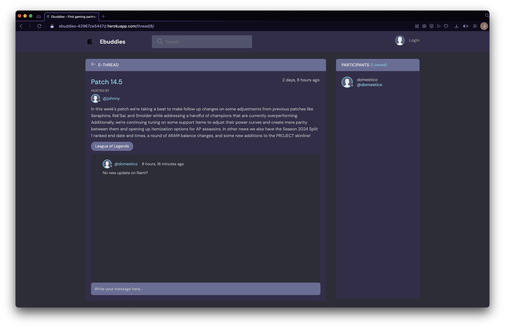

# Testing

> [!NOTE]  
> Return back to the [README.md](README.md) file.

Welcome to the Ebuddies Site testing results, in this file you will see how each and every element and features tested to ensure each features worked as intended.

## Code Validation

### HTML

I have used the recommended [HTML W3C Validator](https://validator.w3.org) to validate all of my pages.

| Page | Screenshot | Notes |
| ---- | ---------- | ----- |
| [Home](https://ebuddies-42967ce5447d.herokuapp.com/) |  | [ERROR] Bad Value |
| [Log-in](https://ebuddies-42967ce5447d.herokuapp.com/login/) |  | [NO ERROR] |
| [Register](https://ebuddies-42967ce5447d.herokuapp.com/register/) |  | [ERROR] 3 The aria-describedby attribute must point to an element in the same document.|
| [Topics](https://ebuddies-42967ce5447d.herokuapp.com/topics/) |  | [ERROR] Bad value |
| [Profile](https://ebuddies-42967ce5447d.herokuapp.com/profile/1/) |  | [ERROR] Bad value |
| [Thread](https://ebuddies-42967ce5447d.herokuapp.com/thread/8/) |  | [NO ERROR] |

### CSS

I have used the recommended [CSS Jigsaw Validator](https://jigsaw.w3.org/css-validator) to validate all of my CSS files.

| Local | Live | Notes |
| --- | --- | --- |
|  |  | Only warrnings -webkit [Local] import fonts warrning |

### JavaScript

I have used the recommended [JShint Validator](https://jshint.com) to validate all of my JS files.

| Directory | File | Screenshot | Notes |
| --- | --- | --- | --- |
| static | script.js |  | No Error |

### Python

I have used the recommended [PEP8 CI Python Linter](https://pep8ci.herokuapp.com) to validate all of my Python files.

| Directory | File | CI URL | Screenshot | Notes |
| --- | --- | --- | --- | --- |
| base | admin.py | [PEP8 CI](https://pep8ci.herokuapp.com/https://raw.githubusercontent.com/JohnnySonTrinh/ebuddies/main/base/admin.py) |  | NO ERRORS |
| base | forms.py | [PEP8 CI](https://pep8ci.herokuapp.com/https://raw.githubusercontent.com/JohnnySonTrinh/ebuddies/main/base/forms.py) |  | NO ERRORS |
| base | models.py | [PEP8 CI](https://pep8ci.herokuapp.com/https://raw.githubusercontent.com/JohnnySonTrinh/ebuddies/main/base/models.py) |  | NO ERRORS |
| base | urls.py | [PEP8 CI](https://pep8ci.herokuapp.com/https://raw.githubusercontent.com/JohnnySonTrinh/ebuddies/main/base/urls.py) |  | NO ERRORS |
| base | views.py | [PEP8 CI](https://pep8ci.herokuapp.com/https://raw.githubusercontent.com/JohnnySonTrinh/ebuddies/main/base/views.py) |  | NO ERRORS |
| ebuddies | urls.py | [PEP8 CI](https://pep8ci.herokuapp.com/https://raw.githubusercontent.com/JohnnySonTrinh/ebuddies/main/ebuddies/urls.py) |  | NO ERRORS |
| root | manage.py | [PEP8 CI](https://pep8ci.herokuapp.com/https://raw.githubusercontent.com/JohnnySonTrinh/ebuddies/main/manage.py) |  |NO ERRORS |

## Browser Compatibility

I've tested my deployed project on multiple browsers to check for compatibility issues.

| Browser | Home | Profile | Log In | Register | Thread | Topic | Notes |
| ------- | ---- | ------- | ------ | -------- | ------ | ----- | ----- |
| Chrome |  |  |  |  |  |  | Works as expected |
| Firefox |  |  |  |  |  |  | Works as expected |
| Opera GX |  |  |  |  |  |  | Works as expected |
| Safari |  |  |  |  |  |  | Works as expected |

